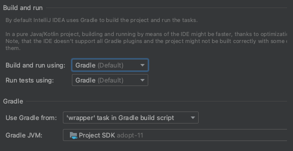

PAYHADA ADMIN V2
=========================

###
### [ Frontend 연동 인터페이스 규격 ]
### (작성예정) https://www.notion.so/payhada-dev/F-B-Admin-09ff83401221488e91837d8372b3cdcd

###
### [ IntelliJ 에서 Frontend(Reactjs) 빌드 실패 시 ]
#### 1. Frontend 모듈 내 오류 여부 확인
```text
 a. cd payhada_admin_renewal/frontend/admin
 b. npm start
```
#### 2. Build 실행 옵션 확인
```text
 a. 상단 "IntelliJ IDEA" > "Preferences" > "Build" > "Build Tools" > "Gradle" 선택
 b. Build and run 실행 옵션 수정 (하기 캡처 참고)
```
